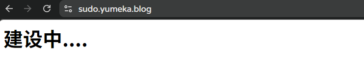
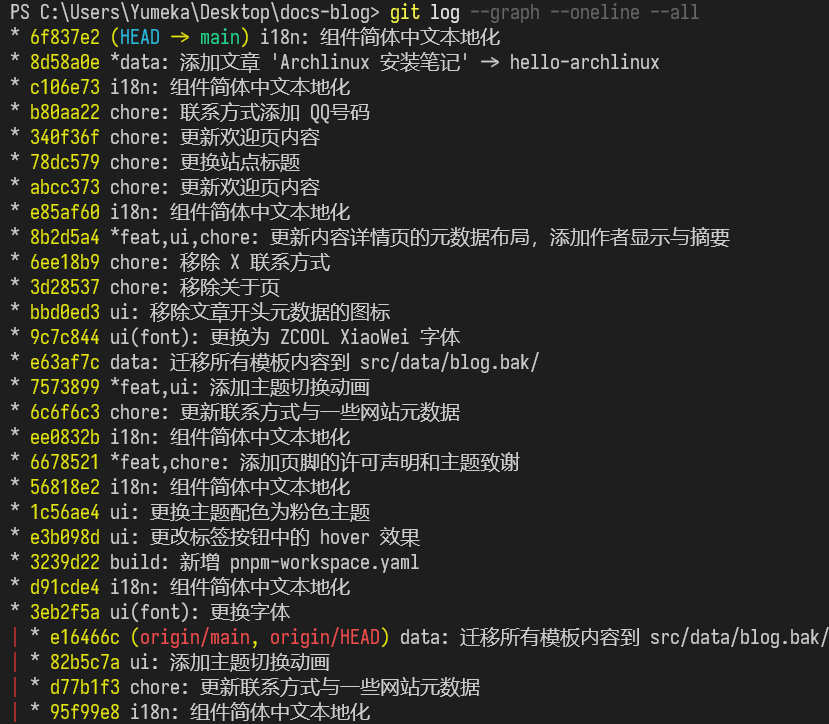

很久以前就想着部署一个技术博客网站，那时候拥有了第一个域名 [yumeka.blog](http://yumeka.blog/)，早早就创建了叫做 blog 的仓库，子域名是 [sudo.yumeka.blog](http://sudo.yumeka.blog/)。

<figcaption class="text-center text-sm -mt-6 mb-6">
没错，目前依旧啥也没有。
</figcaption>

可能因为的确没有什么可以分享的，Obsidian 的个人知识库里记录的东西也很冷门（比如在 Android 上跑一个功能完备的 Chroot Linux 子系统，X11 支持，还带显卡驱动。。。你看，冷门吧）

还有就是找到一个合适的主题真的很难——单纯不符合审美的、交互起来花里胡哨的、密度太低（那种文章卡片超级大的）、一股重工业味道的，包括太现代，太大众的设计风格也不喜欢。

这不最近发现了 [Spaceship](https://www.spaceship.com/) 上的 .COM 域名超级便宜，首年只要 19CNY，续费9.98USD，想到了一个喜欢的名字就买下来了，主域名的 443 上面还没有什么内容，估计会把这个文档库网站挂上去吧。

<figcaption class="text-center text-sm -mt-6 mb-6">
《仙女座之花》
</figcaption>
<figcaption class="text-center text-sm -mt-6 mb-6">
开心地甚至给门牌设计了 Logo，deepseek-v4-pro 和 gemini-3.1-pro 都用上了。
打算一直续费了。
</figcaption>

前几天有人需要帮忙安装操作系统，实践的过程中，顺手写下了一篇文档，还挺实用的？

<figcaption class="text-sm -mt-6 mb-6">
（我想在这里放一个文章卡片，不知道主题有没有这个功能。）
</figcaption>

好了，这下域名和内容都有了。

这就花了差不多整整一个白天，折腾出来了这个网站，上线之前就有了20多个提交。

<figcaption class="text-center text-sm -mt-6 mb-6">
也许工整，也许不工整的提交记录。
</figcaption>

**吐槽:**

AstroPaper 主题的组件文本竟然都是写死的，一个一个汉化真的很折磨。

在原版的基础上加了优雅的主题切换动画，文章内容页的布局也改了改。

还有几个比较丑的图标都干掉了。

不知道为什么文章内容页的 URL 会拼接两次，不知道是不是 BUG。

如果加上修订时间，那么创建时间竟然不会显示。

移动端的导航栏有点丑。

没有层级标题导航的功能。

不同屏幕下的返回顶部按钮长得也不同。

<s>emmmm...这个字体的可读性好像也不是很好。</s>

SEO 分享的图片和网站的 favicon 没有换。

缺一个等宽字体。

**因为部署上线就只有一个光秃秃的文章感觉不太好，所以就有了这篇内容，先这样吧。**
