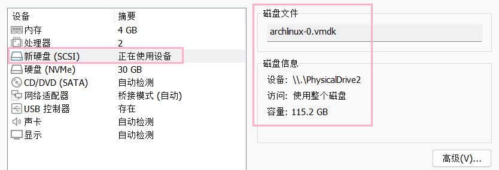
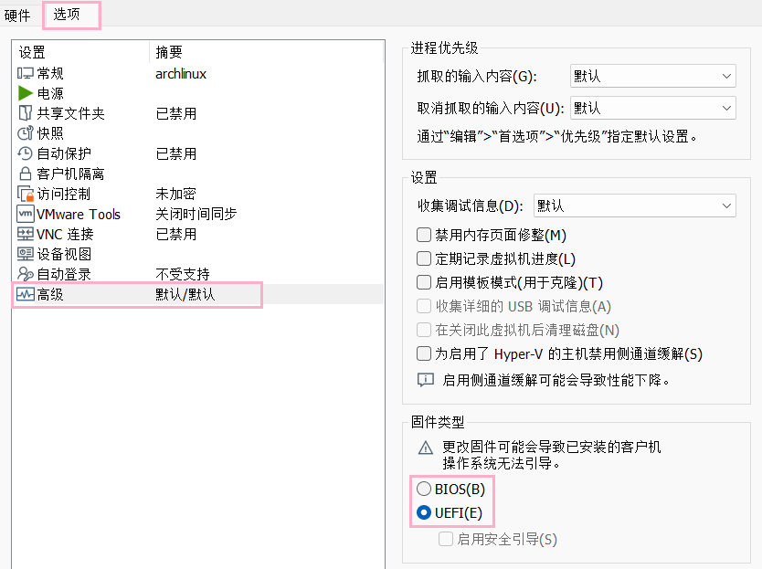

<figure>
  
    <figcaption class="text-center">
    Photo by <a href="https://www.pixiv.net/artworks/54321987">pixiv@pagarmidna</a>
  </figcaption>
</figure>

## VMware 的一些注意事项

### 创建虚拟机

创建虚拟机 时选择 `自定义(高级)`

安装客户机操作系统 中选择 `稍后安装操作系统`, 也就是创建空白硬盘

选择客户机操作系统 中选择 `Ubuntu 64位`

网络类型 选择 `NAT 模式` 或者 `桥接模式`

磁盘类型 选择 `NVMe`

指定磁盘容量 中选择 `将虚拟磁盘存储为单个文件`

_可以在虚拟机设置中选择 ISO 文件启动, 也可以连接物理 U盘_:



_如下步骤开启 UEFI_:



## 开机安装

### 网络

`ping www.baidu.com` ping 一下, 没连上网则联网

### 更方便操作

**开启 SSHD:**

- `systemctl start sshd` 运行 SSHD 服务
- 可以使用 `ip a | grep inet` 查看 ip, 使用 `ssh root@<ip>` 连接
- 需要使用 `passwd` 设置 live 环境的 root 密码才能连接

**临时设置中文:**

- `vim /etc/locale.gen` 编辑语言文件, 取消注释 `zh_CN.UTF-8` 和 `en_US.UTF-8`

  也可以使用以下命令快速替换

  ```bash
  sed -i -e '/^# *en_US.UTF-8 UTF-8/s/^# *//' -e '/^# *zh_CN.UTF-8 UTF-8/s/^# *//' /etc/locale.gen
  ```

- `locale-gen` 生成语言包
- `export LANG=zh_CN.UTF-8` 设置 LANG 环境变量

**禁用震耳欲聋的蜂鸣器:**

- `rmmod pcspkr` 禁用蜂鸣器内核模块

### 修改国内软件源

`vim /etc/pacman.d/mirrorlist` 编辑配置文件,
只保留一行 `Server = https://mirrors.tuna.tsinghua.edu.cn/archlinux/$repo/os/$arch`

### 准备硬盘

使用 `lsblk` 找到磁盘, -f 参数可以查看分区类型

例如安装操作系统到磁盘 nvme0n1 中

`cfdisk /dev/nvme0n1` 编辑磁盘, 创建 512M 的 `EFI系统` 分区, 剩下的创建 Linux 分区, 输入 yes 写入

基本是下面这个样子

```txt
                                    磁盘：/dev/nvme0n1
                     尺寸：30 GiB，32212254720 字节，62914560 个扇区
                 标签：gpt，标识符：50603AF1-6D9F-4BC5-A5D8-C7D053224C84

    设备                      起点         末尾         扇区      大小 类型
>>  /dev/nvme0n1p1            2048      1050623      1048576      512M EFI 系统
    /dev/nvme0n1p2         1050624     62912511     61861888     29.5G Linux 文件系统
```

**给分区格式化文件系统:**

- `mkfs.fat -F 32 /dev/nvme0n1p1` 格式化 EFI 分区为 fat32
- `mkfs.btrfs /dev/nvme0n1p2` 格式化 Linux 分区为 btrfs

**创建子卷:**

`mount /dev/nvme0n1p2 /mnt` 挂载 Linux 分区到 /mnt 文件夹

创建需要的子卷

- `btrfs subvolume create /mnt/@`
- `btrfs subvolume create /mnt/@home`
- `btrfs subvolume create /mnt/@log`

`umount /mnt` 取消挂载 /mnt

**单独挂载子卷:**

- `mount -o noatime,compress=zstd,subvol=@ /dev/nvme0n1p2 /mnt` 挂载根目录 @ 子卷到 /mnt
- `mkdir -p /mnt/{boot,home,var/log}` 创建一些文件夹
- `mount -o noatime,compress=zstd,subvol=@home /dev/nvme0n1p2 /mnt/home` 挂载 @home
- `mount -o noatime,compress=zstd,subvol=@log /dev/nvme0n1p2 /mnt/var/log` 挂载 @log
- `mount /dev/nvme0n1p1 /mnt/boot` 挂载 EFI 分区到 /boot 文件夹

**创建交换文件:**

- `btrfs filesystem mkswapfile --size 2g --uuid clear /mnt/swapfile` 创建到 /mnt/swapfile
- `swapon /mnt/swapfile` 启用

### 安装系统

#### 基础系统

这里只安装了 vim 和 neovim 编辑器, 也可以安装其它喜欢的编辑器

```bash
pacstrap -K /mnt base linux linux-firmware btrfs-progs vim neovim sudo base-devel networkmanager
```

把挂载配置写进 fstab

```bash
genfstab -U /mnt >> /mnt/etc/fstab
```

切换根目录到新系统

```bash
arch-chroot /mnt
```

设置时区

- `ln -sf /usr/share/zoneinfo/Asia/Shanghai /etc/localtime` 设置上海时区
- `hwclock --systohc` 同步硬件时钟
- `date` 验证

根据开头的步骤, 临时设置中文

写入英文语言

```bash
echo "LANG=en_US.UTF-8" > /etc/locale.conf
```

设置 pacman

- `nvim /etc/pacman.conf` 编辑配置文件, 开启颜色显示(Color)和 [multilib] 仓库
- `pacman -Syy` 更新数据库
- `pacman -S git wget openssh` 装点基础东西

设置主机名

```bash
echo "<hostname>" > /etc/hostname
```

设置用户

- `passwd` 设置 root 密码
- `useradd -m -G wheel -s /bin/bash <user>` 添加用户
- `passwd <user>` 设置新用户的密码
- `sed -i 's/^# *%wheel ALL=(ALL:ALL) ALL/%wheel ALL=(ALL:ALL) ALL/' /etc/sudoers` 允许 wheel 组使用 sudo 提权
  也可以使用 `EDITOR=nvim visudo` 编辑配置文件, 取消注释 `%wheel ALL=(ALL:ALL) ALL`

启用必要的服务

```bash
systemctl enable NetworkManager
```

可选开启 SSHD

```bash
systemctl enable sshd
```

#### 可选组件

```bash
pacman -S noto-fonts-cjk noto-fonts-emoji # 中文字体和 emoji 字体
pacman -S plasma sddm # 安装 KDE plasma 桌面, 可选项中选择 noto-fonts、pipewire-jack、qt6-multimedia-ffmpeg
pacman -S dolphin konsole # 安装文件管理器, 终端模拟器
pacman -S mesa # OpenGL 驱动
pacman -S wl-clipboard # 剪贴板工具
pacman -S timeshift # 快照工具
```

启用桌面管理器

```bash
systemctl enable sddm
```

VMware 的设置

- `pacman -S open-vm-tools` 安装 vmware 工具包, 推荐也把 gtkmm3 装上
- `systemctl enable vmtoolsd` 开机启动

#### CPU 徽码、驱动和引导

若在虚拟机中安装系统, 则无需安装 CPU 徽码

安装 CPU 徽码

intel

```bash
pacman -S intel-ucode
```

amd

```bash
pacman -S amd-ucode
```

显卡的设置

- 根据型号安装显卡驱动

设置 GRUB 引导

- `pacman -S grub efibootmgr` 安装 grub 包
- `grub-install --target=x86_64-efi --efi-directory=/boot --bootloader-id=GRUB`
- `grub-mkconfig -o /boot/grub/grub.cfg`

### 退出重启

- `exit` 退出 arch-chroot
- `swapoff -a` 关闭所有 swapfile
- `umount -R /mnt` 卸载 mnt 文件夹
- `lsblk` 检查
- `reboot/poweroff` 重启或关机

## 进入桌面的注意事项

不建议修改 `/etc/locale.conf`, 因为 tty 会中文乱码

推荐在桌面的设置中局部设置语言
